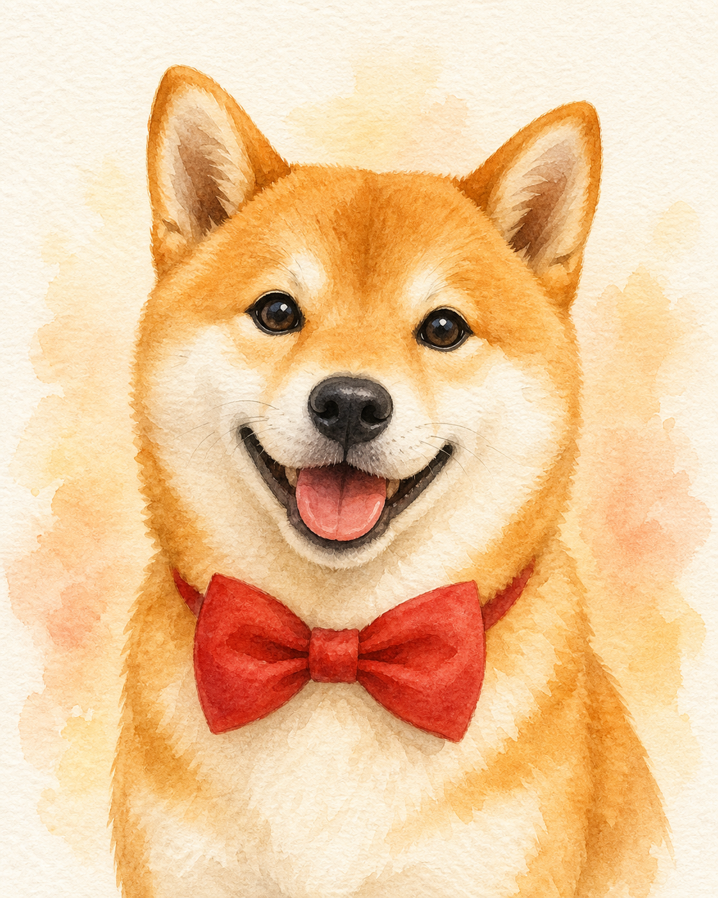

# codex-imagegen

A [Claude Code](https://claude.com/claude-code) skill that generates images by routing through [Codex CLI](https://github.com/openai/codex)'s built-in `$imagegen` tool — using your **ChatGPT subscription quota** instead of OpenAI Images API credits.

If you already pay for ChatGPT (Plus / Pro) and you already have Codex CLI installed, you can generate images from Claude Code without spending another cent.

## What this gives you

- A skill Claude Code automatically picks up when you ask it to generate an image
- A standalone CLI script (`codex-imagegen.sh`) you can use in any batch pipeline
- Detailed prompt-craft guidance baked into the skill so the model produces consistent, useful outputs

## Example output

`./examples/shiba.png` — generated from the prompt:

> A tiny Shiba Inu wearing a red bow tie, watercolor illustration, soft natural texture, close-up portrait, warm soft window light, tender and calm, no text, no watermark.



## Prerequisites

1. **[Codex CLI](https://github.com/openai/codex) installed**

   ```bash
   # one of:
   npm i -g @openai/codex
   brew install --cask codex
   ```

2. **Codex is logged in** to your ChatGPT account at least once:

   ```bash
   codex login
   ```

3. **Claude Code** (the CLI / IDE extension / desktop app) — this is the host that loads skills.

## Install

Clone this repo straight into your Claude Code skills directory:

```bash
git clone https://github.com/yazelin/codex-imagegen-skill ~/.claude/skills/codex-imagegen
chmod +x ~/.claude/skills/codex-imagegen/codex-imagegen.sh
```

That's it. Next time you start Claude Code, the skill is available.

## Verify

Inside Claude Code, ask:

> Generate a cute Shiba Inu with a red bow tie in watercolor style, save to /tmp/test-shiba.png

Claude should invoke the skill and you should see a PNG appear at `/tmp/test-shiba.png` after ~40-70 seconds.

Or test the bundled script directly from your shell:

```bash
~/.claude/skills/codex-imagegen/codex-imagegen.sh \
  "a tiny shiba inu with a red bow tie, watercolor, no text" \
  /tmp/test-shiba.png
```

The script prints the absolute path of the saved PNG on success.

## How it works

`codex exec` (Codex's non-interactive mode) runs the `$imagegen` shorthand the same way the interactive TUI does. The OpenAI image model produces a PNG and Codex saves it to `~/.codex/generated_images/<session-id>/ig_*.png`. Our wrapper script:

1. Captures Codex's stdout to extract the session id.
2. Locates the generated PNG inside that session directory.
3. Copies it to the path you asked for, printing the absolute path on success.

We do the file copy ourselves (not through Codex) because Codex's bubblewrap sandbox can fail on shell operations in nested Linux environments. Doing the copy outside the sandbox is reliable across Linux, macOS, and WSL.

See [`SKILL.md`](./SKILL.md) for the full prompt-craft guidance and when not to use this skill.

## When NOT to use this

This skill uses your **personal ChatGPT subscription quota**. Don't use it as the image-generation backend for a service that serves end users (LINE bot, web app, multi-tenant SaaS) — that's against the spirit of the subscription terms. For production / multi-user serving, use the [OpenAI Images API](https://platform.openai.com/docs/guides/images) with a proper API key.

## License

MIT. See [LICENSE](./LICENSE).

## Credits

Built collaboratively by [@yazelin](https://github.com/yazelin) and Claude Code, validated through a 26-image batch run filling in missing cover images on [yazelin.github.io](https://yazelin.github.io).
